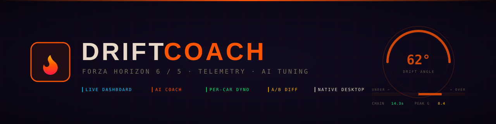

<div align="center">



# Drift Coach

**Self-hosted Forza Horizon 6 / FH5 telemetry dashboard + AI drift-tuning coach.**

[](https://github.com/Durg5/fh6-drift-coach/releases/latest)
[](https://github.com/Durg5/fh6-drift-coach/actions/workflows/ci.yml)
[](LICENSE)
[](#stack)

Records sessions, builds a per-car dyno from your runs, and feeds everything to an LLM (Ollama, Claude, OpenAI) that knows drift tuning specifically.

[**Download installer**](https://github.com/Durg5/fh6-drift-coach/releases/latest) · [**Quick start**](#quick-start-5-minutes-from-clone-to-driving) · [**First clean run guide**](#your-first-clean-run--step-by-step) · [**What weird features do**](#what-the-weird-named-features-actually-do)

</div>

---

> ⚠️ **Vibe-coded disclaimer.**
> This whole project was built collaboratively with an LLM over a couple of
> long evenings. It works great **for the author's setup** but specific
> features may not work 100% on yours — different hardware, OSes, AI providers,
> or Forza configurations can surface edge cases. Treat it as a power-user toy,
> not a polished product. PRs welcome.

## Download (recommended)

The fastest path is the **native installer** for your platform from the [latest release](https://github.com/Durg5/fh6-drift-coach/releases/latest):

| Platform | File |
|---|---|
| **Windows** | `Drift Coach_x.y.z_x64_en-US.msi` (recommended) or the `.exe` setup |
| **macOS (Apple Silicon)** | `Drift Coach_x.y.z_aarch64.dmg` |
| **macOS (Intel)** | `Drift Coach_x.y.z_x64.dmg` |
| **Linux (any distro)** | `Drift Coach_x.y.z_amd64.AppImage` — `chmod +x`, double-click |
| **Linux (Debian/Ubuntu)** | `drift-coach_x.y.z_amd64.deb` |

Installers are unsigned for now (free), so Windows shows SmartScreen and macOS shows Gatekeeper on first launch — bypass once and you're set. Source is open if you'd rather build from scratch (see [Build from source](#desktop-app-windows--macos--linux-installer)).

---

---

## What you get

- **Live telemetry dashboard** — drift-angle gauge, live drift score, slip-balance bar, G-force compass (physical-sensation oriented), per-car dyno + power band, drift chain timer, suspension behavior, tire heat
- **Session recording with auto-pause** — pauses when Forza pauses (game menu / rewind), resumes when frames return. Saves to a per-car log.
- **AI Drift Coach** — chat with an LLM that has been fed a curated drift-tuning guide as canonical reference. Two modes:
  - **TUNE REVIEW** — full context (tune + saved session + memory + reference library + canonical guide)
  - **LIVE DIAGNOSTIC** — telemetry-only, no tune bias; tells you whether a chassis is even worth tuning for drift
- **Per-car siloing** — fill in Make / Year / Model in `/tune` and every session, memory note, chat history, and dyno is keyed to that car. Switch cars in `/tune` and the entire UI swaps to that car's data.
- **Tune revisions + A/B diff** — every tune you save shows up in a history list. Pick two with DIFF buttons to see the deltas in FH6 menu order.
- **Reference tune library** — mark known-good tunes as references and the AI uses them as cross-car ground truth.
- **Adaptive coach memory** — type "stiffer rear ARB caused snap-overs" and the coach remembers it next time.

---

## Quick start (5 minutes from clone to driving)

### 1. Prerequisites

- **Node.js 20 or newer** — [nodejs.org](https://nodejs.org/)
- **Forza Horizon 6 (or 5)** with Data Out enabled (see step 4)
- *Optional but recommended:* an AI provider key (Ollama Cloud is the cheapest; Claude/OpenAI also work)

### 2. Install

**Linux / macOS / WSL:**
```bash
git clone https://github.com/Durg5/fh6-drift-coach.git
cd fh6-drift-coach
./install.sh
```

**Windows (PowerShell):**
```powershell
git clone https://github.com/Durg5/fh6-drift-coach.git
cd fh6-drift-coach
.\install.ps1
```

The installer will:
- Check Node version
- Auto-pick free ports (default 3002 HTTP, 5330 UDP; walks forward if either is busy)
- Install npm dependencies
- Build the production bundle
- Write a `.env` with the chosen ports

### 3. Start

```bash
./start.sh        # Linux / macOS / WSL
.\start.ps1       # Windows
```

Open the dashboard at `http://localhost:3002` (or whatever port the installer picked).

### 4. Configure Forza

In Forza Horizon 6 / 5: **Settings → HUD and Gameplay → Data Out** (or similar):

| Field | Value |
|---|---|
| Data Out | **ON** |
| Format | **Car Dash** (NOT "Sled" — won't have all the data) |
| Out IP | The IP of the machine running drift-coach (use `127.0.0.1` if same machine) |
| Out Port | Whatever your install said (default **5330**) |

If you don't see telemetry within a few seconds of getting in a car, the IP/port is wrong — drift-coach's status bar will say "OFFLINE" instead of "LIVE".

### 5. Add an AI provider key

Open `http://localhost:3002/settings`, pick a provider tab, paste your API key, hit SAVE.

- **Ollama Cloud** — best price/performance for drift coaching. Get a key at [ollama.com](https://ollama.com/). Use model `minimax-m3:cloud` (reasoning-capable, ~$0.40/M tokens).
- **Anthropic** — most polished answers. Uses `claude-sonnet-4-6` with extended thinking. Get a key at [console.anthropic.com](https://console.anthropic.com/).
- **OpenAI** — also works, `gpt-4o`. Get a key at [platform.openai.com](https://platform.openai.com/).
- **Local Ollama** — fully offline. Install [Ollama](https://ollama.com/), `ollama pull qwen2.5:14b`, and point baseUrl to `http://localhost:11434/v1`.

Keys are stored in `~/.config/drift-coach/settings.json` — never committed, never sent anywhere except the AI provider.

### 6. Drop the tuning guide (optional but recommended)

If a markdown file exists at `~/DRIFT_COACH_TUNING_GUIDE.md`, drift-coach auto-injects it into every chat as canonical reference. The repo doesn't ship a guide (drift tuning advice is opinionated; bring your own). Use your favorite YouTube tutorial / written guide / community wisdom — convert it to markdown and drop it there.

---

## Your first clean run — step by step

This is the workflow drift-coach is designed around. Follow it once and the rest is intuition.

1. **Pick a car in Forza** and enter Freeroam (Drift Zones work too).
2. **In drift-coach, go to `/tune`** and fill in the build bar:
   - **MAKE / YEAR / MODEL** → e.g. `Nissan / 2002 / R34 GTR`. This is the per-car key — sessions, memory, chats are siloed by this.
   - **POWER / WEIGHT / WT DIST / PI** → from the in-game build screen. **PI** = Performance Index, Forza's class number (700 = A class, 800 = S1, etc.). Lower is generally easier to drift; 600-700 is the sweet spot per most drift coaching content.
   - **DRIVETRAIN** → for drift, always **RWD**. The coach will never suggest AWD.
   - **TIRES** → set to whatever's actually fitted. **Drift compound** locks the rear end's behavior into Forza's drift physics; **Street** is the next-best for "real-feel" drifting per most guides.
   - **AERO** → none / splitter / wing / both. Cars without aero hide the aero fields in the tune grid automatically.
   - **FEEL** → leave as `— rate —` for now. You'll set this AFTER driving.
3. **Fill in the 9 tune sections below** with your current FH6 values, in this order (matches the in-game tune menu top to bottom):
   1. Tires (PSI F/R)
   2. Gearing (Final Drive + each gear ratio)
   3. Alignment (Camber F/R, Toe F/R, Caster F)
   4. ARB (Anti-Roll Bars F/R)
   5. Springs (Rate F/R + Ride Height F/R)
   6. Damping (Rebound F/R + Bump F/R)
   7. Aero (only shows fields for what your car has)
   8. Brake (Balance + Force)
   9. Differential (Accel %, Decel %; rear-only since drift = RWD)
4. **Hit SAVE in the REVISIONS panel** with a name like `R34 baseline`. This is your starting tune snapshot.
5. **Click START RECORDING** on `/coach` (or use the REC button on `/live`).
6. **Drive in Forza.** Three full-throttle pulls through the gears build the dyno curve. Then go drift something — a couple of corners, a long sustained slide, whatever feels normal.
7. **Click STOP**, name the session (auto-fills `2002 Nissan R34 GTR · <feel> · 14:32`), click SAVE.
8. **Now rate FEEL on the tune** — Good / Medium / Bad / N/A. This drives how aggressively the AI changes things:
   - **GOOD** → "minor refinements only, ±5-10%"
   - **MEDIUM** → "moderate corrections, 15-25%"
   - **BAD** → "major overhaul OK"
   - **N/A** → full assessment from telemetry alone
9. **In `/coach`:** Mode = **TUNE REVIEW**. Click your saved session in the log — it auto-fills as the analysis target. Type "review this run, what should I change?" and hit SEND.
10. **Wait for the response** — the THINKING box opens orange while it reasons. The coach will reply with a markdown table of recommended changes in FH6 order, plus an **ACCEPT TUNE → APPLY + SAVE** button at the bottom.
11. **Click ACCEPT** — the suggested values write directly to the live tune fields and save as a new revision named `Coach suggestion · <car> · <timestamp>`.
12. **Set those new values in Forza**, then record another run and repeat. After a couple of cycles, mark a really good run's tune as a **REFERENCE** (★ on the session row) so the AI uses it as cross-car ground truth.

---

## What the weird-named features actually do

| Feature | What it is | Why it matters |
|---|---|---|
| **FEEL rating** | Good / Medium / Bad / N/A dropdown on the tune | Scales how aggressively the AI changes your tune. GOOD = small tweaks; BAD = "rethink direction" |
| **PI (Performance Index)** | Forza's overall power-vs-handling number (200-999) | Lower = easier to control. Coach uses this + class to pick reasonable tune ranges |
| **Reference Library** | A set of tunes you've marked as known-good | The AI sees ALL of them on every TUNE REVIEW call and uses them as ground-truth. Cross-car learning. |
| **Coach Memory** | Free-form text notes you write | Auto-included in every AI request as "learned truths." Use it to capture "this car always wants ARB rear < 10" or "controller mode = front PSI > 30" |
| **Canonical Guide** | A markdown file at `~/DRIFT_COACH_TUNING_GUIDE.md` | The AI's textbook. Loaded on every request unless mode = LIVE DIAGNOSTIC (which strips ALL context for an unbiased read). |
| **Tune Review mode** | Full-stack context to the AI: tune + session + memory + library + guide | The main workflow. Use when you have a recorded session you want analyzed. |
| **Live Diagnostic mode** | Telemetry-only, no tune bias, no guide | Use to ask "is this car even worth tuning for drift?" before you commit to building it. |
| **Dyno + Power Band card** | Per-car HP/torque curve built from your full-throttle runs | Tells you where to set gears + final drive to live in the power band during drift |
| **Drift Chain card** | Live counter for current chain duration + session best | Real-time scoreboard while you drive |
| **G-Force compass** | XY plot of lateral × longitudinal G | Oriented to physical sensation: accel = dot back, brake = dot forward, turn right = dot left (where your body shoves into the door) |
| **Slip-balance bar** | Front vs rear combined-slip ratio | Cyan = understeer, orange = oversteer. Live tuning gauge. |
| **A/B Diff** | Pick two tune revisions, see deltas in FH6 menu order | Compare a coach suggestion to your baseline without scrolling |
| **Session Compare** | Pick two saved sessions, see stat deltas + dual mini-maps | "Did rear ARB at 8 actually reduce snap-overs?" |
| **Auto-pause** | Detects when telemetry stops flowing | Freezes session timer + recording when you pause Forza; resumes cleanly on unpause |

---

## Privacy

- All API keys live in `~/.config/drift-coach/` (outside the project tree). Never committed.
- Saved sessions, tune revisions, references, coach memory, dyno data — also all in `~/.config/drift-coach/`. Local-only.
- Chat history is **browser localStorage**, keyed per car. Never server-side.
- The only network calls drift-coach makes:
  - To Forza's UDP listener (in-bound, local network)
  - To your configured AI provider's API (out-bound, the provider you chose in Settings)

Nothing is sent to a central server. No telemetry, no analytics, no auth.

---

## Troubleshooting

**"OFFLINE" in the header** — Forza isn't reaching the UDP port. Check Data Out is ON, format is "Car Dash" (not Sled), the IP is correct (use `127.0.0.1` if same machine, your LAN IP if different machine), the port matches `FORZA_PORT` in `.env`, and Windows Firewall isn't blocking UDP.

**Coach won't respond / no thinking box** — Check `/settings`. The active provider tab needs to be lit (not opacity-dim). If all tabs are dim, no key is set or the key invalid. Open browser DevTools console (F12) and check for errors — drift-coach logs `[coach] send() called` when the request fires.

**Chat just hangs** — model is reasoning too long. Click the STOP button (red square) that replaces SEND while in-flight.

**The tune page is blank** — most likely a corrupted saved revision/reference (happens when the AI accepts a malformed suggestion). Check the browser console for `Cannot read properties of undefined`. Delete `~/.config/drift-coach/revisions.json` or `reference-tunes.json` and restart.

**Port already in use** — `install.sh` / `install.ps1` walks forward to the next free port. Re-run the installer to pick a new one and update `.env`.

---

## Desktop app (Windows / macOS / Linux installer)

The web version is the primary mode — but you can also build a native desktop app that wraps the whole thing in a single installer. The user double-clicks an `.exe` / `.dmg` / `.deb` / `.AppImage`, the app launches, the Nuxt server runs as a hidden sidecar, and a native window opens to the dashboard.

**Output size:** ~80-100 MB per platform (includes a portable Node.js + the Nuxt build + Tauri's tiny Rust wrapper that uses the OS's native webview, not Chromium).

### Build it once

You only need the build toolchain ONE time. After that everyone you ship the installer to gets a one-click install.

**Prerequisites (one-time):**

| Tool | Why | Install |
|---|---|---|
| Rust (1.77+) | Tauri's Rust core | https://rustup.rs/ |
| Node 20+ | Already needed for the web build | https://nodejs.org/ |
| Platform deps (Linux only) | webkit2gtk, libsoup, etc. | See [Tauri Linux prerequisites](https://v2.tauri.app/start/prerequisites/#linux) |

**Build the installer:**

```bash
git clone https://github.com/Durg5/fh6-drift-coach.git
cd fh6-drift-coach
npm install
npm run desktop:build
```

What it does:
1. Downloads a portable Node.js binary for your platform → `src-tauri/binaries/node-sidecar-<target>`
2. Renders icon set from `icons/icon-source.svg`
3. Runs `nuxt build` → copies `.output/` into `src-tauri/nuxt/`
4. Runs `cargo tauri build` → produces a native installer

**Find your installer:**

| Platform | Where it lands |
|---|---|
| Windows | `src-tauri/target/release/bundle/msi/Drift Coach_0.1.0_x64_en-US.msi` (and `.exe`) |
| macOS | `src-tauri/target/release/bundle/dmg/Drift Coach_0.1.0_aarch64.dmg` (and `.app`) |
| Linux | `src-tauri/target/release/bundle/deb/drift-coach_0.1.0_amd64.deb` and `appimage/Drift Coach_0.1.0_amd64.AppImage` |

### Dev loop

```bash
npm run desktop:dev     # builds once and runs with hot-reloaded Rust on save
```

### What ships in the installer

- The Tauri Rust binary (≈ 8 MB) — opens a webview window using the OS's native engine (WebView2 on Windows, WebKit on Mac, GTK-WebKit on Linux)
- A portable Node.js binary (≈ 50 MB) — runs the embedded server as a sidecar process
- The Nuxt build output (≈ 15 MB) — the actual app code, identical to the web version

When the user double-clicks the app, the Rust wrapper picks a random free port, spawns the Node sidecar with `PORT=<that port>`, polls until the server answers, then opens the window to `http://127.0.0.1:<port>`. On close, the sidecar is killed. All user data (sessions / tunes / keys) still lives in `~/.config/drift-coach/` — identical to the web version, so users can switch between web and desktop without losing anything.

---

## "I just want to get this running" — paste this into Claude Code

If you don't want to follow the steps manually, paste **the entire block below** into a new Claude Code session and let it drive. It handles fresh installs, dependency checks, AI key setup prompts, and (optionally) the desktop build:

```
I want to install and run Drift Coach from https://github.com/Durg5/fh6-drift-coach.

Please drive the entire setup for me:

1. Clone the repo to ~/fh6-drift-coach (create the parent dir if needed). If the
   path already exists with the repo, do `git pull` instead.
2. Read README.md to understand the project — surface the vibe-coded disclaimer
   to me so I know what I'm getting into.
3. Detect my OS. Run the appropriate installer from the repo root:
     - macOS / Linux / WSL: ./install.sh
     - Windows: .\install.ps1
   The installer auto-picks free ports and builds the production bundle. Tell
   me which port it picked.
4. Ask me whether I want to add an AI provider key now or later. If now:
     - Ask which provider (Ollama Cloud / Anthropic / OpenAI / local Ollama).
     - Ask for the key, then write it to ~/.config/drift-coach/settings.json
       (read README.md "Privacy" section for the exact shape).
     - DO NOT echo the key back to me in the final summary.
5. Ask whether I want a) just the web version, or b) also a native desktop
   installer (.msi / .dmg / .deb).
     - If web only: skip to step 7.
     - If desktop: continue with step 6.
6. Verify the desktop build toolchain:
     - Check `rustc --version` (need 1.77+). If missing, install rustup
       (https://rustup.rs) non-interactively and source the env.
     - On Linux, check the webkit2gtk + libsoup prerequisites from the Tauri
       Linux setup guide. Install via the system package manager if missing.
   Then run `npm run desktop:build`. This takes 5-10 minutes on first run
   (Rust compile + Node sidecar download + icon rasterize + Nuxt build).
   At the end, tell me the exact path to the installer for my platform from
   the table in README.md.
7. Start the web server (`./start.sh` or `.\start.ps1`) in the background and
   print the URL to open in a browser.
8. Print a checklist of "things to do in Forza" from README.md step 4 so I
   know how to point the game at the app.

If anything fails, show me the error verbatim and pause before continuing.
Don't skip the confirmation prompts in this list — I want to make decisions
about provider keys and desktop vs web BEFORE you commit me to long
operations.
```

Save that as a snippet — works for any fresh machine.

---

## Stack

- **Frontend**: Nuxt 4 (app/ dir), Vue 3, @nuxt/ui 3, Tailwind v4
- **Backend**: Nitro (Nuxt's server), WebSocket for telemetry push
- **Telemetry parser**: Auto-detects FH5 (311 bytes) vs FH6 (323+ bytes), reads all 60+ fields
- **AI**: Streaming chat with thinking-block extraction (works for OpenAI-compat models that emit `<think>` tags AND Anthropic's structured thinking blocks)
- **Storage**: Plain JSON in `~/.config/drift-coach/`. No database.

---

## License

MIT — see [LICENSE](LICENSE).
